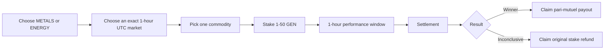
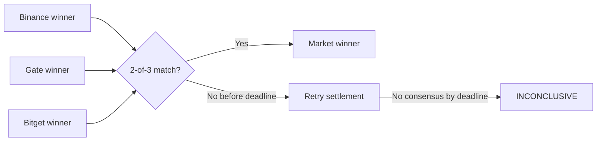

# FORGE

_1-hour commodity dominance markets on GenLayer._

FORGE is a permissionless prediction market where users back the commodity
with the highest percentage return over an exact 1-hour UTC window.

**Live Demo:** [forge-markets.vercel.app](https://forge-markets.vercel.app/)

## How it works

Choose a category, choose an exact future UTC-hour market, and stake GEN on one
commodity. Betting closes when that performance window begins. After the hour
ends, the market can be settled from independent exchange evidence.



Each market:

- uses a 1-hour window starting on an exact UTC-hour boundary;
- accepts bets only before the performance window begins;
- requires a minimum stake of `1 GEN`;
- caps cumulative stake at `50 GEN` per wallet per market;
- allows one commodity per wallet per market;
- allows same-side top-ups, but does not allow switching sides; and
- charges a `0%` protocol fee.

## Supported markets

Forge has two fixed categories. Every market compares the three commodities in
its category.

| Category | Commodities |
| --- | --- |
| `METALS` | GOLD · SILVER · COPPER |
| `ENERGY` | WTI Crude (`WTI_CRUDE`) · Brent Crude (`BRENT_CRUDE`) · Natural Gas (`NATURAL_GAS`) |

The question is always: which of the three commodities will have the highest
percentage return during this exact 1-hour UTC window?

## Settlement

Forge uses Binance, Gate, and Bitget as independent sources. Each source uses
its own open and close values for the same 1-hour candle and calculates:

```text
return = (close - open) / open
```

Each source then selects the commodity with the highest numerical return. The
contract does not average prices or returns across exchanges; the three
exchanges act as independent votes.

A source contributes no vote when its evidence is unavailable or fails the
contract's validation rules, or when its three returns produce an exact tie.
Settlement requires `2 of 3` matching `VALID` source winners.

The market lasts one hour. Settlement becomes available after the performance
hour ends and can be retried for a further 30 minutes. If no 2-of-3 result is
reached before that retry deadline, the market becomes `INCONCLUSIVE`.



Example:

```text
Binance → GOLD
Gate → GOLD
Bitget → SILVER
```

Result → GOLD wins with 2-of-3 consensus.

## Payouts and refunds

All GEN staked in a market forms one pool. In a normally settled market, users
on the winning side share the full pool in proportion to their winning stake.
The protocol fee is `0%`.

```text
payout = total market pool × user winning stake / total winning stake
```

The final winning claimant receives any remaining integer-rounding amount, so
the full pool can be distributed.

If consensus selects a winning commodity with zero GEN staked while the market
contains funds, the market becomes `INCONCLUSIVE` instead. Users can claim back
their original stake. The same refund path applies to any market that reaches
the inconclusive state.

## Why GenLayer?

Forge uses GenLayer so settlement can evaluate external exchange evidence and
reach validator consensus around the resulting market outcome. The contract
then records the market result and controls the winner, payout, or refund path
under the same rules for every caller.

## Deployment

| Field | Value |
| --- | --- |
| Network | GenLayer StudioNext |
| Chain ID | `61997` |
| Contract | [`0xcfA2625BC9bC6d1D34D4865e2f790087AE00fD15`](https://explorer-studio-dev.genlayer.com/address/0xcfA2625BC9bC6d1D34D4865e2f790087AE00fD15) |
| RPC | `https://studio-dev.genlayer.com/api` |

## Contract interface

### Reads

The contract exposes reads for protocol configuration and market discovery,
market details and state, connected-wallet positions and claimable positions,
source evidence, betting state, and wallet activity.

```text
categories
category_assets
get_config
get_market
get_markets
get_open_markets
get_market_count
get_market_by_category_start
get_my_position
get_my_market_count
get_my_positions
get_my_claimable_markets
get_source_evidence
get_betting_state
get_my_activity_count
get_my_activity
```

### Writes

```text
create_market
place_bet
settle_market
claim
claim_refund
```

`place_bet` is the only payable write. Settlement is permissionless: any wallet
can call `settle_market` once the market's performance window has ended.

## Frontend

The frontend is a TanStack Start application connected to the Forge contract
through `genlayer-js`. Current user-facing areas are:

- Markets (`/` and `/markets`)
- Market detail (`/market/:id`)
- Portfolio (`/portfolio`)
- Create Market (`/create`)
- How it works (`/how-it-works`)
- Notification bell in the shared header

Wallet-specific reads and writes use the connected injected browser wallet.
The market detail page also shows source evidence and pool composition. Its live
performance area is informational only and is not connected to settlement.

## Run locally

```bash
cd frontend
bun install
bun run dev
```

To create a production build:

```bash
bun run build
```

## Project structure

```text
forge/
├── contracts/
│   └── Forge.py
├── frontend/
│   ├── src/
│   ├── package.json
│   └── bun.lock
├── tests/
│   ├── direct/
│   └── integration/
├── docs/
├── artifacts/
├── gltest.config.yaml
├── requirements.txt
└── README.md
```

## Status

- Forge intelligent contract deployed on GenLayer StudioNext.
- Frontend pages and contract-backed reads and writes are implemented.
- Wallet actions use the deployed contract through an injected wallet.
- Live performance display data is not connected yet; it does not determine settlement.
